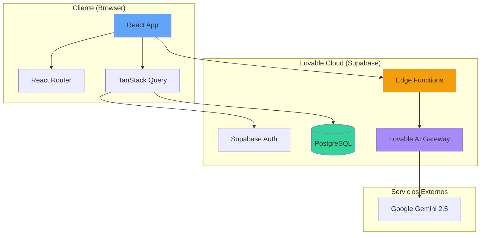
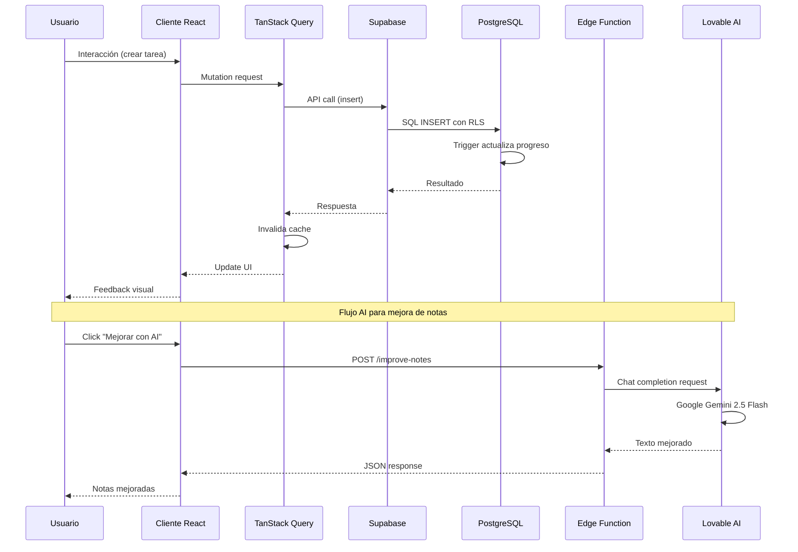
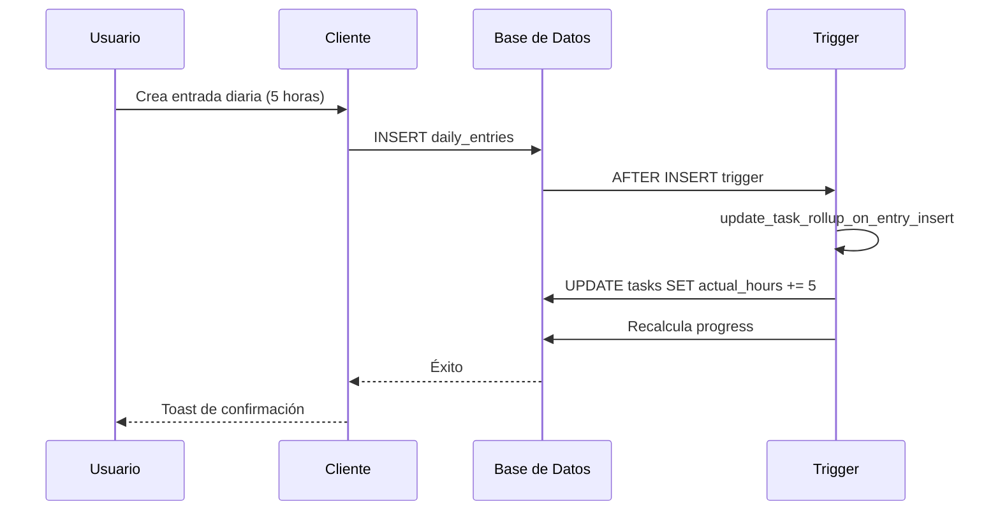
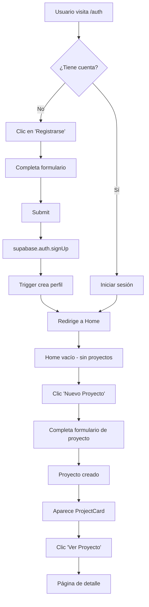
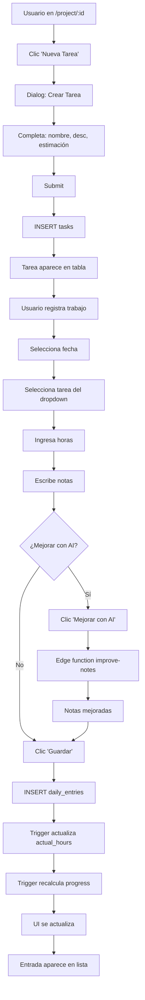
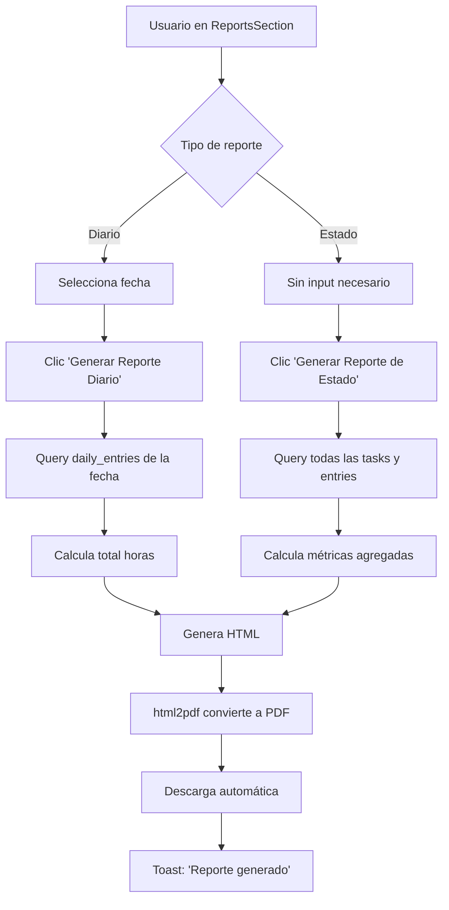

# Especificación Técnica Completa
## Sistema de Gestión de Proyectos y Registro de Trabajo

---

## 📋 Tabla de Contenidos

1. [Resumen Ejecutivo](#resumen-ejecutivo)
2. [Arquitectura del Sistema](#arquitectura-del-sistema)
3. [Base de Datos](#base-de-datos)
4. [Funcionalidades del Sistema](#funcionalidades-del-sistema)
5. [Componentes de la Interfaz](#componentes-de-la-interfaz)
6. [Lógica de Negocio](#lógica-de-negocio)
7. [Integraciones](#integraciones)
8. [Flujos de Usuario](#flujos-de-usuario)
9. [Seguridad](#seguridad)
10. [Características Avanzadas](#características-avanzadas)

---

## 1. Resumen Ejecutivo

### 1.1 Propósito del Sistema
Sistema web para la gestión de proyectos, seguimiento de tareas y registro de trabajo diario. Permite a los usuarios crear proyectos, definir tareas con estimaciones, registrar horas de trabajo diarias y generar reportes en PDF.

### 1.2 Tecnologías Principales

| Categoría | Tecnología | Versión | Propósito |
|-----------|-----------|---------|-----------|
| Frontend | React | 18.3.1 | Framework UI |
| Lenguaje | TypeScript | - | Type safety |
| Estilos | Tailwind CSS | - | Diseño responsive |
| Routing | React Router | 6.30.1 | Navegación SPA |
| State Management | TanStack Query | 5.83.0 | Server state |
| Backend | Supabase | 2.76.1 | BaaS completo |
| Build Tool | Vite | - | Build y dev server |
| Forms | React Hook Form | 7.61.1 | Manejo de formularios |
| PDF Generation | html2pdf.js | 0.12.1 | Reportes PDF |
| AI | Lovable AI | - | Mejora de notas |
| Drag & Drop | @dnd-kit | 6.3.1 | Reordenamiento tareas |

### 1.3 Características Principales
- ✅ Autenticación de usuarios
- ✅ Gestión de proyectos (CRUD)
- ✅ Sistema de tareas con estimaciones y progreso
- ✅ Registro diario de trabajo con asociación a tareas
- ✅ Mejora de notas con IA
- ✅ Sistema de facturación con numeración automática
- ✅ Generación de reportes PDF (diario, estado y facturas)
- ✅ Gestión de estados de factura (Pendiente/Cobrado)
- ✅ Cálculo automático de progreso
- ✅ Drag & drop para reordenar tareas
- ✅ Validación de datos

---

## 2. Arquitectura del Sistema

### 2.1 Arquitectura General



### 2.2 Estructura de Carpetas

```
proyecto/
├── src/
│   ├── components/
│   │   ├── ui/                    # Componentes shadcn/ui
│   │   ├── projects/              # Componentes de proyectos
│   │   │   ├── CreateProjectDialog.tsx
│   │   │   └── ProjectCard.tsx
│   │   ├── project-detail/        # Componentes de detalle
│   │   │   ├── CreateTaskDialog.tsx
│   │   │   ├── DailyEntriesList.tsx
│   │   │   ├── DailyWorkLog.tsx
│   │   │   ├── EditDueDate.tsx
│   │   │   ├── EditEntryDialog.tsx
│   │   │   ├── EditTaskDialog.tsx
│   │   │   ├── ProjectSummary.tsx
│   │   │   ├── ReportsSection.tsx
│   │   │   ├── TaskSection.tsx
│   │   │   └── TaskTable.tsx
│   │   ├── billing/               # Componentes de facturación
│   │   │   ├── CreateInvoiceDialog.tsx
│   │   │   └── InvoiceDetail.tsx
│   │   └── BrandLogo.tsx
│   ├── pages/
│   │   ├── Auth.tsx               # Autenticación
│   │   ├── Home.tsx               # Lista de proyectos
│   │   ├── ProjectDetail.tsx      # Detalle de proyecto
│   │   ├── ProjectBilling.tsx     # Gestión de facturas
│   │   └── NotFound.tsx
│   ├── lib/
│   │   ├── ai.ts                  # Cliente AI
│   │   ├── brand.ts               # Constantes de marca
│   │   ├── date.ts                # Utilidades de fecha
│   │   ├── reports.ts             # Lógica de reportes
│   │   ├── invoicePdf.ts          # Generación PDF facturas
│   │   ├── utils.ts               # Utilidades generales
│   │   └── validation.ts          # Validación de datos
│   ├── hooks/
│   │   ├── use-mobile.tsx         # Hook responsive
│   │   └── use-toast.ts           # Hook toasts
│   ├── integrations/
│   │   └── supabase/
│   │       ├── client.ts          # Cliente Supabase
│   │       └── types.ts           # Tipos generados
│   ├── App.tsx
│   ├── main.tsx
│   └── index.css
├── supabase/
│   ├── functions/
│   │   └── improve-notes/
│   │       └── index.ts           # Edge function AI
│   └── config.toml                # Configuración Supabase
└── public/
```

### 2.3 Flujo de Datos



---

## 3. Base de Datos

### 3.1 Esquema Completo

```mermaid
erDiagram
    profiles ||--o{ projects : owns
    profiles ||--o{ invoice_counters : has
    projects ||--o{ tasks : contains
    projects ||--o{ daily_entries : has
    projects ||--o{ reports : generates
    projects ||--o{ invoices : billed_in
    tasks ||--o{ daily_entries : tracked_in
    invoices ||--o{ invoice_items : contains
    daily_entries ||--o| invoices : billed_in
    
    profiles {
        uuid id PK
        text email
        text full_name
        timestamp created_at
        timestamp updated_at
    }
    
    invoice_counters {
        uuid owner_uid PK_FK
        integer last_number
        timestamp updated_at
    }
    
    projects {
        uuid id PK
        uuid owner_uid FK
        text name
        text sow
        date due_date
        numeric hourly_rate
        boolean archived
        timestamp created_at
        timestamp updated_at
    }
    
    tasks {
        uuid id PK
        uuid project_id FK
        text name
        text description
        numeric estimated_hours_min
        numeric estimated_hours_max
        numeric actual_hours
        numeric progress
        integer display_order
        timestamp created_at
        timestamp updated_at
    }
    
    daily_entries {
        uuid id PK
        uuid project_id FK
        uuid task_id FK
        uuid author_uid FK
        uuid invoice_id FK
        date date_iso
        numeric hours
        text notes
        timestamp created_at
    }
    
    invoices {
        uuid id PK
        uuid owner_uid FK
        uuid project_id FK
        integer invoice_number
        date date
        numeric total_amount
        text status
        text notes
        timestamp created_at
        timestamp updated_at
    }
    
    invoice_items {
        uuid id PK
        uuid invoice_id FK
        uuid daily_entry_id FK
        text description
        date entry_date
        text task_name
        numeric hours
        numeric rate
        numeric amount
        timestamp created_at
    }
    
    reports {
        uuid id PK
        uuid project_id FK
        text report_type
        date date_iso
        text content
        timestamp created_at
        timestamp updated_at
    }
```

### 3.2 Tablas Detalladas

#### 3.2.1 profiles

| Campo | Tipo | Nullable | Default | Descripción |
|-------|------|----------|---------|-------------|
| id | uuid | No | - | PK, referencia a auth.users |
| email | text | Sí | - | Email del usuario |
| full_name | text | Sí | - | Nombre completo |
| created_at | timestamptz | Sí | now() | Fecha creación |
| updated_at | timestamptz | Sí | now() | Fecha actualización |

**Índices:**
- PRIMARY KEY (id)

**RLS Policies:**
1. `Users can view their own profile` (SELECT)
   - `auth.uid() = id`
2. `Users can insert their own profile` (INSERT)
   - `auth.uid() = id`
3. `Users can update their own profile` (UPDATE)
   - `auth.uid() = id`
4. `Users can delete their own profile` (DELETE)
   - `auth.uid() = id`

---

#### 3.2.2 projects

| Campo | Tipo | Nullable | Default | Descripción |
|-------|------|----------|---------|-------------|
| id | uuid | No | gen_random_uuid() | PK |
| owner_uid | uuid | No | - | FK a auth.users |
| name | text | No | - | Nombre del proyecto |
| sow | text | Sí | - | Statement of Work (alcance) |
| due_date | date | Sí | - | Fecha de entrega |
| hourly_rate | numeric | Sí | 65 | Tarifa por hora |
| archived | boolean | Sí | false | Estado de archivo |
| created_at | timestamptz | Sí | now() | Fecha creación |
| updated_at | timestamptz | Sí | now() | Fecha actualización |

**Índices:**
- PRIMARY KEY (id)
- INDEX ON owner_uid

**RLS Policies:**
1. `Users can view their own projects` (SELECT)
   - `auth.uid() = owner_uid`
2. `Users can create their own projects` (INSERT)
   - `auth.uid() = owner_uid`
3. `Users can update their own projects` (UPDATE)
   - `auth.uid() = owner_uid`
4. `Users can delete their own projects` (DELETE)
   - `auth.uid() = owner_uid`

**Triggers:**
- `update_updated_at_column` BEFORE UPDATE
  - Actualiza `updated_at = NOW()`

---

#### 3.2.3 tasks

| Campo | Tipo | Nullable | Default | Descripción |
|-------|------|----------|---------|-------------|
| id | uuid | No | gen_random_uuid() | PK |
| project_id | uuid | No | - | FK a projects |
| name | text | No | - | Nombre de la tarea |
| description | text | Sí | - | Descripción detallada |
| estimated_hours_min | numeric | Sí | - | Estimación mínima (horas) |
| estimated_hours_max | numeric | No | - | Estimación máxima (horas) |
| actual_hours | numeric | Sí | 0 | Horas reales registradas |
| progress | numeric | Sí | 0 | Porcentaje de progreso (0-100) |
| display_order | integer | Sí | 0 | Orden de visualización |
| created_at | timestamptz | Sí | now() | Fecha creación |
| updated_at | timestamptz | Sí | now() | Fecha actualización |

**Índices:**
- PRIMARY KEY (id)
- INDEX ON project_id
- INDEX ON display_order

**RLS Policies:**
1. `Users can view tasks from their own projects` (SELECT)
   ```sql
   EXISTS (
     SELECT 1 FROM projects 
     WHERE projects.id = tasks.project_id 
       AND projects.owner_uid = auth.uid()
   )
   ```
2. `Users can create tasks in their own projects` (INSERT)
3. `Users can update tasks in their own projects` (UPDATE)
4. `Users can delete tasks from their own projects` (DELETE)

**Triggers:**
1. `set_task_display_order` BEFORE INSERT
   - Si `display_order` es NULL, asigna MAX(display_order) + 1
2. `recompute_task_progress_on_update` BEFORE UPDATE
   - Recalcula `progress = ROUND(actual_hours / estimated_hours_max * 100)`
3. `update_updated_at_column` BEFORE UPDATE

---

#### 3.2.4 daily_entries

| Campo | Tipo | Nullable | Default | Descripción |
|-------|------|----------|---------|-------------|
| id | uuid | No | gen_random_uuid() | PK |
| project_id | uuid | No | - | FK a projects |
| task_id | uuid | Sí | - | FK a tasks (opcional) |
| author_uid | uuid | No | - | FK a auth.users |
| date_iso | date | No | - | Fecha del trabajo (ISO) |
| hours | numeric | No | - | Horas trabajadas |
| notes | text | Sí | - | Notas del trabajo |
| invoice_id | uuid | Sí | - | FK a invoices (NULL = no facturado) |
| created_at | timestamptz | Sí | now() | Fecha creación |

**Índices:**
- PRIMARY KEY (id)
- INDEX ON project_id
- INDEX ON task_id
- INDEX ON date_iso
- INDEX ON author_uid

**RLS Policies:**
1. `Users can view daily entries from their own projects` (SELECT)
   ```sql
   EXISTS (
     SELECT 1 FROM projects 
     WHERE projects.id = daily_entries.project_id 
       AND projects.owner_uid = auth.uid()
   )
   ```
2. `Users can create daily entries in their own projects` (INSERT)
   - `auth.uid() = author_uid AND <exists check>`
3. `Users can update daily entries in their own projects` (UPDATE)
4. `Users can delete daily entries from their own projects` (DELETE)

**Triggers:**
1. `update_task_rollup_on_entry_insert` AFTER INSERT
   - Incrementa `actual_hours` en la tarea asociada
   - Recalcula `progress` de la tarea
2. `update_task_rollup_on_entry_update` AFTER UPDATE
   - Si cambia `task_id`: revierte horas de tarea anterior y aplica a nueva
   - Si cambian `hours`: aplica delta a la tarea actual
3. `update_task_rollup_on_entry_delete` AFTER DELETE
   - Decrementa `actual_hours` de la tarea
   - Recalcula `progress`

---

#### 3.2.5 reports

| Campo | Tipo | Nullable | Default | Descripción |
|-------|------|----------|---------|-------------|
| id | uuid | No | gen_random_uuid() | PK |
| project_id | uuid | No | - | FK a projects |
| report_type | text | No | - | Tipo: 'daily' o 'status' |
| date_iso | date | Sí | - | Fecha del reporte (para daily) |
| content | text | Sí | - | Contenido HTML del reporte |
| created_at | timestamptz | Sí | now() | Fecha generación |
| updated_at | timestamptz | Sí | now() | Fecha actualización |

**RLS Policies:**
- Políticas similares a otras tablas (basadas en project ownership)

---

#### 3.2.6 invoice_counters

| Campo | Tipo | Nullable | Default | Descripción |
|-------|------|----------|---------|-------------|
| owner_uid | uuid | No | - | PK/FK a auth.users |
| last_number | integer | No | 0 | Último número de factura usado |
| updated_at | timestamptz | No | now() | Fecha última actualización |

**RLS Policies:**
1. `Counters: owner can select` (SELECT)
   - `auth.uid() = owner_uid`
2. `Counters: owner can update` (UPDATE)
   - `auth.uid() = owner_uid`
3. `Counters: owner can insert` (INSERT)
   - `auth.uid() = owner_uid`

---

#### 3.2.7 invoices

| Campo | Tipo | Nullable | Default | Descripción |
|-------|------|----------|---------|-------------|
| id | uuid | No | gen_random_uuid() | PK |
| owner_uid | uuid | No | - | FK a auth.users |
| project_id | uuid | No | - | FK a projects |
| invoice_number | integer | No | - | Número secuencial (auto-asignado) |
| date | date | No | CURRENT_DATE | Fecha de emisión |
| total_amount | numeric | No | 0 | Monto total |
| status | text | No | 'Pendiente' | Estado: Pendiente/Cobrado |
| notes | text | Sí | - | Notas/condiciones |
| created_at | timestamptz | No | now() | Fecha creación |
| updated_at | timestamptz | No | now() | Fecha actualización |

**Índices:**
- PRIMARY KEY (id)
- UNIQUE (owner_uid, invoice_number)
- INDEX ON owner_uid
- INDEX ON project_id
- INDEX ON status

**RLS Policies:**
1. `Invoices: owner select` (SELECT)
   - `auth.uid() = owner_uid`
2. `Invoices: owner insert` (INSERT)
   - `auth.uid() = owner_uid`
3. `Invoices: owner update` (UPDATE)
   - `auth.uid() = owner_uid`
4. `Invoices: owner delete` (DELETE)
   - `auth.uid() = owner_uid`

**Triggers:**
- `trg_set_invoice_number` BEFORE INSERT
  - Asigna automáticamente `invoice_number` usando `next_invoice_number()`

---

#### 3.2.8 invoice_items

| Campo | Tipo | Nullable | Default | Descripción |
|-------|------|----------|---------|-------------|
| id | uuid | No | gen_random_uuid() | PK |
| invoice_id | uuid | No | - | FK a invoices |
| daily_entry_id | uuid | No | - | FK a daily_entries |
| description | text | No | - | Descripción de la línea |
| entry_date | date | No | - | Fecha de la entrada trabajada |
| task_name | text | Sí | - | Nombre de la tarea |
| hours | numeric | No | - | Horas facturadas |
| rate | numeric | No | - | Tarifa por hora |
| amount | numeric | No | - | Importe (hours * rate) |
| created_at | timestamptz | No | now() | Fecha creación |

**Índices:**
- PRIMARY KEY (id)
- INDEX ON invoice_id
- INDEX ON daily_entry_id

**RLS Policies:**
1. `Invoice items: owner select` (SELECT)
   ```sql
   EXISTS (
     SELECT 1 FROM invoices i
     WHERE i.id = invoice_items.invoice_id
       AND i.owner_uid = auth.uid()
   )
   ```
2. `Invoice items: owner insert` (INSERT)
3. `Invoice items: owner delete` (DELETE)

---

### 3.3 Funciones de Base de Datos

#### 3.3.1 handle_new_user()
```sql
CREATE OR REPLACE FUNCTION public.handle_new_user()
RETURNS trigger
LANGUAGE plpgsql
SECURITY DEFINER
SET search_path TO 'public'
AS $function$
BEGIN
  INSERT INTO public.profiles (id, email, full_name)
  VALUES (
    NEW.id,
    NEW.email,
    COALESCE(NEW.raw_user_meta_data->>'full_name', NEW.email)
  );
  RETURN NEW;
END;
$function$
```
**Propósito:** Crear perfil automáticamente cuando un usuario se registra.

---

#### 3.3.2 set_task_display_order()
```sql
CREATE OR REPLACE FUNCTION public.set_task_display_order()
RETURNS trigger
LANGUAGE plpgsql
SECURITY DEFINER
SET search_path TO 'public'
AS $function$
BEGIN
  IF NEW.display_order IS NULL THEN
    SELECT COALESCE(MAX(t.display_order), -1) + 1
      INTO NEW.display_order
      FROM public.tasks t
     WHERE t.project_id = NEW.project_id;
  END IF;
  RETURN NEW;
END;
$function$
```
**Propósito:** Asignar automáticamente el siguiente número de orden.

---

#### 3.3.3 recompute_task_progress_on_update()
```sql
CREATE OR REPLACE FUNCTION public.recompute_task_progress_on_update()
RETURNS trigger
LANGUAGE plpgsql
SECURITY DEFINER
SET search_path TO 'public'
AS $function$
BEGIN
  NEW.progress := LEAST(
    100,
    ROUND(
      COALESCE(NULLIF(NEW.actual_hours, 0), 0) / NULLIF(NEW.estimated_hours_max, 0) * 100
    )
  );
  RETURN NEW;
END;
$function$
```
**Propósito:** Recalcular progreso antes de actualizar una tarea.

---

#### 3.3.4 update_task_rollup_on_entry_insert()
```sql
CREATE OR REPLACE FUNCTION public.update_task_rollup_on_entry_insert()
RETURNS trigger
LANGUAGE plpgsql
SECURITY DEFINER
SET search_path TO 'public'
AS $function$
BEGIN
  IF NEW.task_id IS NOT NULL THEN
    UPDATE public.tasks
    SET 
      actual_hours = actual_hours + NEW.hours,
      progress = LEAST(100, ROUND((actual_hours + NEW.hours) / estimated_hours_max * 100)),
      updated_at = NOW()
    WHERE id = NEW.task_id;
  END IF;
  
  RETURN NEW;
END;
$function$
```
**Propósito:** Actualizar horas y progreso de tarea al insertar entrada diaria.

---

#### 3.3.5 update_task_rollup_on_entry_update()
```sql
CREATE OR REPLACE FUNCTION public.update_task_rollup_on_entry_update()
RETURNS trigger
LANGUAGE plpgsql
SECURITY DEFINER
SET search_path TO 'public'
AS $function$
DECLARE
  old_task UUID := OLD.task_id;
  new_task UUID := NEW.task_id;
  old_hours NUMERIC := COALESCE(OLD.hours, 0);
  new_hours NUMERIC := COALESCE(NEW.hours, 0);
BEGIN
  -- Si la tarea cambió: revertir en la anterior y aplicar en la nueva
  IF old_task IS DISTINCT FROM new_task THEN
    IF old_task IS NOT NULL THEN
      UPDATE public.tasks
      SET actual_hours = GREATEST(0, actual_hours - old_hours),
          progress = LEAST(100, ROUND(GREATEST(0, actual_hours - old_hours) / NULLIF(estimated_hours_max,0) * 100)),
          updated_at = NOW()
      WHERE id = old_task;
    END IF;

    IF new_task IS NOT NULL THEN
      UPDATE public.tasks
      SET actual_hours = actual_hours + new_hours,
          progress = LEAST(100, ROUND((actual_hours + new_hours) / NULLIF(estimated_hours_max,0) * 100)),
          updated_at = NOW()
      WHERE id = new_task;
    END IF;

  -- Misma tarea pero cambió horas: aplicar delta
  ELSIF old_hours IS DISTINCT FROM new_hours AND new_task IS NOT NULL THEN
    UPDATE public.tasks
    SET actual_hours = GREATEST(0, actual_hours - old_hours + new_hours),
        progress = LEAST(100, ROUND(GREATEST(0, actual_hours - old_hours + new_hours) / NULLIF(estimated_hours_max,0) * 100)),
        updated_at = NOW()
    WHERE id = new_task;
  END IF;

  RETURN NEW;
END;
$function$
```
**Propósito:** Manejar cambios de tarea o horas en entradas existentes.

---

#### 3.3.6 update_task_rollup_on_entry_delete()
```sql
CREATE OR REPLACE FUNCTION public.update_task_rollup_on_entry_delete()
RETURNS trigger
LANGUAGE plpgsql
SECURITY DEFINER
SET search_path TO 'public'
AS $function$
BEGIN
  IF OLD.task_id IS NOT NULL THEN
    UPDATE public.tasks
    SET 
      actual_hours = GREATEST(0, actual_hours - OLD.hours),
      progress = LEAST(100, ROUND(GREATEST(0, actual_hours - OLD.hours) / estimated_hours_max * 100)),
      updated_at = NOW()
    WHERE id = OLD.task_id;
  END IF;
  
  RETURN OLD;
END;
$function$
```
**Propósito:** Revertir horas al eliminar una entrada diaria.

---

#### 3.3.7 update_updated_at_column()
```sql
CREATE OR REPLACE FUNCTION public.update_updated_at_column()
RETURNS trigger
LANGUAGE plpgsql
SET search_path TO 'public'
AS $function$
BEGIN
  NEW.updated_at = NOW();
  RETURN NEW;
END;
$function$
```
**Propósito:** Actualizar automáticamente timestamp de modificación.

---

#### 3.3.8 next_invoice_number()
```sql
CREATE OR REPLACE FUNCTION public.next_invoice_number(p_owner UUID)
RETURNS INTEGER
LANGUAGE plpgsql
SECURITY DEFINER
SET search_path = public
AS $$
DECLARE
  v_next INTEGER;
BEGIN
  INSERT INTO public.invoice_counters(owner_uid, last_number)
  VALUES (p_owner, 1)
  ON CONFLICT (owner_uid)
  DO UPDATE SET 
    last_number = public.invoice_counters.last_number + 1,
    updated_at = NOW()
  RETURNING last_number INTO v_next;

  RETURN v_next;
END;
$$
```
**Propósito:** Generar número secuencial de factura por usuario de forma thread-safe.

---

#### 3.3.9 set_invoice_number()
```sql
CREATE OR REPLACE FUNCTION public.set_invoice_number()
RETURNS TRIGGER
LANGUAGE plpgsql
SECURITY DEFINER
SET search_path = public
AS $$
BEGIN
  IF NEW.invoice_number IS NULL OR NEW.invoice_number <= 0 THEN
    NEW.invoice_number := public.next_invoice_number(NEW.owner_uid);
  END IF;
  NEW.updated_at := NOW();
  RETURN NEW;
END;
$$
```
**Propósito:** Trigger que asigna automáticamente el número de factura antes del INSERT.

---

## 4. Funcionalidades del Sistema

### 4.1 Autenticación y Usuarios

#### 4.1.1 Registro de Usuarios
- **Ubicación:** `/auth`
- **Componente:** `Auth.tsx`
- **Método:** Email + Password
- **Flujo:**
  1. Usuario completa formulario (email, password, confirmación)
  2. Validación client-side con React Hook Form + Zod
  3. Llamada a `supabase.auth.signUp()`
  4. Trigger `handle_new_user()` crea perfil automáticamente
  5. Auto-confirmación de email (configurado en Supabase)
  6. Redirección a `/` (Home)

#### 4.1.2 Inicio de Sesión
- **Método:** Email + Password
- **Persistencia:** LocalStorage (Supabase)
- **Auto-refresh:** Token JWT automático
- **Flujo:**
  1. Usuario ingresa credenciales
  2. Llamada a `supabase.auth.signInWithPassword()`
  3. Supabase valida y retorna sesión
  4. Redirección a Home

#### 4.1.3 Cierre de Sesión
- **Método:** `supabase.auth.signOut()`
- **Limpieza:** LocalStorage y cache de TanStack Query

---

### 4.2 Gestión de Proyectos

#### 4.2.1 Listar Proyectos (Home)
- **Ruta:** `/`
- **Componente:** `Home.tsx`
- **Query:**
  ```typescript
  supabase
    .from('projects')
    .select('*')
    .eq('owner_uid', user.id)
    .eq('archived', false)
    .order('created_at', { ascending: false })
  ```
- **UI:** Grid de `ProjectCard` componentes
- **Filtros:** Solo proyectos activos (no archivados)

#### 4.2.2 Crear Proyecto
- **Componente:** `CreateProjectDialog.tsx`
- **Campos:**
  - `name` (text, requerido)
  - `sow` (textarea, opcional)
  - `due_date` (date, opcional)
  - `hourly_rate` (numeric, default: 65)
- **Validación:**
  ```typescript
  validateRequired(name, "Nombre del proyecto")
  sanitizeText(sow, 5000)
  validateNumber(hourly_rate, 0, 10000)
  ```
- **Inserción:**
  ```typescript
  supabase.from('projects').insert({
    name,
    sow,
    due_date,
    hourly_rate,
    owner_uid: user.id
  })
  ```

#### 4.2.3 Editar Proyecto
- **Componentes:** 
  - `EditDueDate.tsx` (fecha de entrega)
  - Edición inline en `ProjectSummary.tsx`
- **Actualización:**
  ```typescript
  supabase.from('projects').update({ due_date }).eq('id', projectId)
  ```

#### 4.2.4 Archivar Proyecto
- **Acción:** Marcar `archived = true`
- **UI:** Botón en `ProjectCard`
- **Reversible:** Sí (cambiar a `false`)

---

### 4.3 Gestión de Tareas

#### 4.3.1 Listar Tareas
- **Componente:** `TaskTable.tsx`
- **Query:**
  ```typescript
  supabase
    .from('tasks')
    .select('*')
    .eq('project_id', projectId)
    .order('display_order', { ascending: true })
    .order('created_at', { ascending: true })
  ```
- **Visualización:** Tabla con columnas:
  - Nombre
  - Descripción
  - Estimación (min-max horas)
  - Horas reales
  - Progreso (%)
  - Acciones (editar, eliminar)

#### 4.3.2 Crear Tarea
- **Componente:** `CreateTaskDialog.tsx`
- **Campos:**
  - `name` (text, requerido)
  - `description` (textarea, opcional)
  - `estimated_hours_min` (numeric, opcional)
  - `estimated_hours_max` (numeric, requerido)
- **Validación:**
  ```typescript
  validateRequired(name, "Nombre de la tarea")
  validateNumber(estimated_hours_max, 0.1, 10000)
  if (min) validateNumber(estimated_hours_min, 0.1, 10000)
  if (min && max && min > max) throw Error("Min > Max")
  ```
- **Auto-asignación:** `display_order` asignado por trigger

#### 4.3.3 Editar Tarea
- **Componente:** `EditTaskDialog.tsx`
- **Campos editables:** Todos excepto `id`, `project_id`, `actual_hours`, `progress`
- **Actualización:**
  ```typescript
  supabase.from('tasks').update(taskData).eq('id', taskId)
  ```
- **Trigger:** `recompute_task_progress_on_update` recalcula progreso

#### 4.3.4 Eliminar Tarea
- **Diálogo:** Confirmación con AlertDialog
- **Cascada:** 
  - Las entradas diarias asociadas actualizan sus `task_id` a `NULL` (si se implementa ON DELETE SET NULL)
  - O bien, se bloquea eliminación si hay entradas (depende de implementación)
- **Acción:**
  ```typescript
  supabase.from('tasks').delete().eq('id', taskId)
  ```

#### 4.3.5 Reordenar Tareas
- **Librería:** `@dnd-kit/core`, `@dnd-kit/sortable`
- **Componente:** `TaskTable.tsx`
- **Lógica:**
  1. Drag & drop de filas
  2. Recalcular `display_order` para todas las tareas
  3. Bulk update a base de datos
  ```typescript
  items.forEach((task, index) => {
    supabase.from('tasks').update({ display_order: index }).eq('id', task.id)
  })
  ```

---

### 4.4 Registro de Trabajo Diario

#### 4.4.1 Crear Entrada Diaria
- **Componente:** `DailyWorkLog.tsx`
- **Campos:**
  - `date_iso` (date picker, default: hoy)
  - `task_id` (select dropdown, opcional)
  - `hours` (number input, requerido)
  - `notes` (textarea, opcional)
- **Validación:**
  ```typescript
  validateRequired(date_iso, "Fecha")
  validateNumber(hours, 0.1, 24)
  sanitizeText(notes, 2000)
  ```
- **Inserción:**
  ```typescript
  supabase.from('daily_entries').insert({
    project_id,
    task_id: task_id === 'none' ? null : task_id,
    author_uid: user.id,
    date_iso,
    hours,
    notes
  })
  ```
- **Trigger:** `update_task_rollup_on_entry_insert` actualiza tarea

#### 4.4.2 Listar Entradas por Fecha
- **Componente:** `DailyEntriesList.tsx`
- **Query:**
  ```typescript
  supabase
    .from('daily_entries')
    .select('*, tasks(name)')
    .eq('project_id', projectId)
    .eq('date_iso', selectedDate)
    .order('created_at', { ascending: false })
  ```
- **Visualización:** Lista con horas, tarea, notas, acciones

#### 4.4.3 Editar Entrada
- **Componente:** `EditEntryDialog.tsx`
- **Campos editables:** `task_id`, `hours`, `notes`
- **Trigger:** `update_task_rollup_on_entry_update` maneja cambios

#### 4.4.4 Eliminar Entrada
- **Trigger:** `update_task_rollup_on_entry_delete` revierte horas

---

### 4.5 Mejora de Notas con IA

#### 4.5.1 Cliente AI
- **Archivo:** `src/lib/ai.ts`
- **Función:**
  ```typescript
  export async function generateWithAI(prompt: string): Promise<string> {
    const { data, error } = await supabase.functions.invoke('improve-notes', {
      body: { notes: prompt }
    });
    
    if (error) throw new Error(error.message);
    if (data?.error) throw new Error(data.error);
    
    return data?.improvedNotes || '';
  }
  ```

#### 4.5.2 Edge Function
- **Ruta:** `supabase/functions/improve-notes/index.ts`
- **Método:** POST
- **Body:** `{ notes: string }`
- **Proceso:**
  1. Recibe notas del usuario
  2. Construye prompt con system message:
     ```
     Eres un redactor técnico senior. Escribe en español neutro, 
     claro y profesional. Corrige errores tipográficos y mejora 
     la cohesión. Usa viñetas si conviene, títulos cortos y listas 
     ordenadas. Mantén los números y hechos tal como aparecen.
     ```
  3. Llama a Lovable AI Gateway:
     ```typescript
     fetch('https://ai.gateway.lovable.dev/v1/chat/completions', {
       method: 'POST',
       headers: {
         'Authorization': `Bearer ${LOVABLE_API_KEY}`,
         'Content-Type': 'application/json'
       },
       body: JSON.stringify({
         model: 'google/gemini-2.5-flash',
         messages: [
           { role: 'system', content: systemPrompt },
           { role: 'user', content: notes }
         ]
       })
     })
     ```
  4. Extrae texto mejorado de respuesta
  5. Retorna `{ improvedNotes: string }`

#### 4.5.3 Manejo de Errores
- **429 Too Many Requests:** Rate limit excedido
- **402 Payment Required:** Créditos agotados
- **500 Internal Server Error:** Error del gateway
- **UI:** Toast con mensaje de error

---

### 4.6 Generación de Reportes PDF

#### 4.6.1 Reporte Diario
- **Componente:** `ReportsSection.tsx`
- **Función:** `generateDaily()`
- **Input:** Fecha seleccionada
- **Proceso:**
  1. Query entradas de la fecha:
     ```typescript
     supabase
       .from('daily_entries')
       .select('*, tasks(name)')
       .eq('project_id', projectId)
       .eq('date_iso', selectedDate)
     ```
  2. Calcular total de horas: `entries.reduce((sum, e) => sum + e.hours, 0)`
  3. Generar HTML:
     ```html
     <div style="padding: 20px; font-family: Arial;">
       <h1>Reporte Diario - ${projectName}</h1>
       <p><strong>Fecha:</strong> ${formatDate(date)}</p>
       <p><strong>Total de Horas:</strong> ${totalHours}</p>
       
       <h2>Entradas:</h2>
       ${entries.map(entry => `
         <div style="margin-bottom: 20px; border-bottom: 1px solid #ccc;">
           <p><strong>Tarea:</strong> ${entry.tasks?.name || 'Sin tarea'}</p>
           <p><strong>Horas:</strong> ${entry.hours}</p>
           <p><strong>Notas:</strong> ${entry.notes || '-'}</p>
         </div>
       `).join('')}
     </div>
     ```
  4. Convertir a PDF con html2pdf.js:
     ```typescript
     const element = document.createElement('div');
     element.innerHTML = htmlContent;
     
     html2pdf()
       .from(element)
       .set({
         margin: 10,
         filename: `reporte-diario-${projectName}-${date}.pdf`,
         html2canvas: { scale: 2 },
         jsPDF: { unit: 'mm', format: 'a4', orientation: 'portrait' }
       })
       .save();
     ```

#### 4.6.2 Reporte de Estado
- **Función:** `generateStatus()`
- **Proceso:**
  1. Query todas las tareas del proyecto:
     ```typescript
     supabase.from('tasks').select('*').eq('project_id', projectId)
     ```
  2. Query todas las entradas diarias:
     ```typescript
     supabase
       .from('daily_entries')
       .select('*, tasks(name)')
       .eq('project_id', projectId)
       .order('date_iso', { ascending: true })
     ```
  3. Calcular métricas del proyecto:
     ```typescript
     const totalEstimated = tasks.reduce((sum, t) => sum + t.estimated_hours_max, 0);
     const totalActual = tasks.reduce((sum, t) => sum + t.actual_hours, 0);
     const overallProgress = (totalActual / totalEstimated * 100).toFixed(1);
     ```
  4. Agrupar entradas por tarea:
     ```typescript
     const entriesByTask = entries.reduce((acc, entry) => {
       const key = entry.task_id || 'Sin tarea';
       if (!acc[key]) acc[key] = [];
       acc[key].push(entry);
       return acc;
     }, {});
     ```
  5. Generar HTML con:
     - Resumen del proyecto (progreso, horas totales)
     - Tabla de tareas (nombre, estimación, real, progreso)
     - Bitácora por tarea (entradas diarias agrupadas)
  6. Convertir a PDF

---

### 4.7 Sistema de Facturación

#### 4.7.1 Crear Factura
- **Ruta:** `/project/:projectId/billing`
- **Componente:** `CreateInvoiceDialog.tsx`
- **Proceso:**
  1. **Cargar Entradas No Facturadas:**
     ```typescript
     supabase
       .from('daily_entries')
       .select('id, date_iso, hours, notes, task_id, tasks(name)')
       .eq('project_id', projectId)
       .is('invoice_id', null)
       .order('date_iso', { ascending: true })
     ```
  2. **Selección de Entradas:**
     - UI con checkboxes para cada entrada
     - Filtros por rango de fechas
     - Botón "Seleccionar todas"
     - Cálculo en tiempo real: total horas, tarifa, importe
  
  3. **Creación de Factura:**
     ```typescript
     // Paso 1: Crear factura (invoice_number asignado por trigger)
     const { data: invoice } = await supabase
       .from('invoices')
       .insert({
         owner_uid: user.id,
         project_id: projectId,
         status: 'Pendiente',
         date: selectedDate || new Date().toISOString().slice(0,10),
         total_amount: 0,
         notes: invoiceNotes
       })
       .select()
       .single();
     
     // Paso 2: Crear líneas de factura
     const items = selectedEntries.map(entry => ({
       invoice_id: invoice.id,
       daily_entry_id: entry.id,
       description: `[${entry.date_iso}] ${entry.tasks?.name || 'Trabajo'} — ${entry.notes?.slice(0,140)}`,
       entry_date: entry.date_iso,
       task_name: entry.tasks?.name || null,
       hours: entry.hours,
       rate: project.hourly_rate,
       amount: entry.hours * project.hourly_rate
     }));
     
     await supabase.from('invoice_items').insert(items);
     
     // Paso 3: Marcar entradas como facturadas
     await supabase
       .from('daily_entries')
       .update({ invoice_id: invoice.id })
       .in('id', selectedEntries.map(e => e.id));
     
     // Paso 4: Actualizar total
     await supabase
       .from('invoices')
       .update({ total_amount: totalAmount })
       .eq('id', invoice.id);
     ```

#### 4.7.2 Listar Facturas
- **Componente:** `ProjectBilling.tsx`
- **Query:**
  ```typescript
  supabase
    .from('invoices')
    .select('id, invoice_number, date, total_amount, status')
    .eq('project_id', projectId)
    .order('date', { ascending: false })
  ```
- **UI:** Tabla con:
  - Número de factura
  - Fecha de emisión
  - Monto total
  - Estado (Badge: Pendiente/Cobrado)
  - Acciones: Ver detalle

#### 4.7.3 Ver Detalle de Factura
- **Componente:** `InvoiceDetail.tsx`
- **Queries:**
  ```typescript
  // Factura con datos relacionados
  const { data: invoice } = await supabase
    .from('invoices')
    .select('*, projects(name), profiles:owner_uid(full_name)')
    .eq('id', invoiceId)
    .single();
  
  // Líneas de factura
  const { data: items } = await supabase
    .from('invoice_items')
    .select('*')
    .eq('invoice_id', invoiceId)
    .order('entry_date', { ascending: true });
  ```
- **Funcionalidades:**
  - Visualización completa de la factura
  - Botón "Descargar PDF"
  - Cambio de estado (Pendiente ↔ Cobrado)
  - Tabla de líneas con descripción, fecha, horas, tarifa, importe

#### 4.7.4 Generación de PDF de Factura
- **Archivo:** `src/lib/invoicePdf.ts`
- **Función:** `downloadInvoicePDF(params)`
- **Características:**
  - Logo de la empresa
  - Información del proyecto y emisor
  - Tabla de líneas con detalles de cada entrada
  - Total calculado
  - Notas/condiciones de pago
  - Formato profesional con html2pdf.js
- **Configuración:**
  ```typescript
  html2pdf().set({
    margin: 10,
    filename: `Factura-${invoiceNumber}.pdf`,
    html2canvas: { scale: 2, useCORS: true },
    jsPDF: { unit: 'mm', format: 'a4', orientation: 'portrait' }
  })
  ```

#### 4.7.5 Gestión de Estados
- **Estados Disponibles:**
  - `Pendiente`: Factura creada, pago pendiente
  - `Cobrado`: Factura pagada
- **Actualización:**
  ```typescript
  await supabase
    .from('invoices')
    .update({ status: newStatus, updated_at: new Date().toISOString() })
    .eq('id', invoiceId);
  ```

#### 4.7.6 Validaciones y Reglas de Negocio
1. **No permitir facturar entradas ya facturadas**
   - Filtro: `invoice_id IS NULL`
2. **Numeración secuencial automática**
   - Garantizada por trigger + función transaccional
3. **Integridad referencial**
   - No se pueden eliminar entradas diarias facturadas (FK con RESTRICT)
   - Si se elimina factura (solo Pendientes), restaurar `invoice_id = NULL` en entradas
4. **Cálculo de totales**
   - Siempre basado en: `SUM(hours * rate)` de las líneas
5. **Proyecto correcto**
   - Solo entradas del mismo proyecto pueden facturarse juntas

---

## 5. Componentes de la Interfaz

### 5.1 Componentes de UI (shadcn/ui)

Todos los componentes UI base están ubicados en `src/components/ui/` y son personalizaciones de shadcn/ui:

- **button.tsx:** Botones con variantes (default, outline, ghost, destructive)
- **card.tsx:** Tarjetas contenedoras
- **dialog.tsx:** Modales/diálogos
- **input.tsx:** Campos de texto
- **label.tsx:** Etiquetas de formulario
- **select.tsx:** Dropdowns
- **table.tsx:** Tablas
- **textarea.tsx:** Áreas de texto multilinea
- **calendar.tsx:** Selector de fecha (react-day-picker)
- **popover.tsx:** Ventanas emergentes
- **badge.tsx:** Insignias/etiquetas
- **alert-dialog.tsx:** Diálogos de confirmación
- **toast.tsx / toaster.tsx:** Notificaciones toast

### 5.2 Componentes de Proyecto

#### 5.2.1 ProjectCard
- **Props:** `{ project: Project }`
- **Ubicación:** `src/components/projects/ProjectCard.tsx`
- **Funcionalidad:**
  - Muestra nombre, SOW, fecha de entrega
  - Botón "Ver Proyecto" → navega a `/project/:id`
  - Botón "Archivar" → actualiza `archived = true`
  - Badge de estado (activo/archivado)

#### 5.2.2 CreateProjectDialog
- **Props:** `{ onProjectCreated: () => void }`
- **Ubicación:** `src/components/projects/CreateProjectDialog.tsx`
- **Funcionalidad:**
  - Formulario con React Hook Form
  - Validación con funciones de `lib/validation.ts`
  - Inserción en Supabase
  - Toast de éxito/error
  - Callback para refrescar lista

### 5.3 Componentes de Detalle de Proyecto

#### 5.3.1 ProjectSummary
- **Props:** `{ project: Project }`
- **Ubicación:** `src/components/project-detail/ProjectSummary.tsx`
- **Funcionalidad:**
  - Muestra nombre, SOW, fecha de entrega, tarifa
  - Cálculo de métricas agregadas:
    - Total de horas estimadas
    - Total de horas reales
    - Progreso general del proyecto
  - Edición inline de campos (opcional)

#### 5.3.2 TaskSection
- **Props:** `{ projectId: string, onTaskUpdate: () => void }`
- **Ubicación:** `src/components/project-detail/TaskSection.tsx`
- **Funcionalidad:**
  - Header con botón "Nueva Tarea"
  - Contiene `TaskTable`
  - Contiene `CreateTaskDialog`

#### 5.3.3 TaskTable
- **Props:** `{ tasks: Task[], onTaskDeleted: () => void }`
- **Ubicación:** `src/components/project-detail/TaskTable.tsx`
- **Funcionalidad:**
  - Tabla con drag & drop (dnd-kit)
  - Filas con datos de tarea
  - Botones "Editar" y "Eliminar" por fila
  - Confirmación de eliminación con AlertDialog
  - Reordenamiento con actualización en DB

#### 5.3.4 CreateTaskDialog
- **Props:** `{ projectId: string, onTaskCreated: () => void }`
- **Funcionalidad:**
  - Formulario de creación de tarea
  - Campos: nombre, descripción, estimación min/max
  - Validación y sanitización
  - Toast de feedback

#### 5.3.5 EditTaskDialog
- **Props:** `{ task: Task, onTaskUpdated: () => void }`
- **Funcionalidad:**
  - Pre-rellena formulario con datos actuales
  - Permite edición de todos los campos (excepto calculados)
  - Update en Supabase

#### 5.3.6 DailyWorkLog
- **Props:** `{ projectId: string, onEntryAdded: () => void }`
- **Ubicación:** `src/components/project-detail/DailyWorkLog.tsx`
- **Funcionalidad:**
  - Selector de fecha (Calendar)
  - Dropdown de tareas (incluye "Sin tarea")
  - Input de horas
  - Textarea de notas
  - Botón "Mejorar con AI"
  - Botón "Guardar Entrada"
  - Muestra `DailyEntriesList` para la fecha seleccionada

#### 5.3.7 DailyEntriesList
- **Props:** `{ projectId: string, selectedDate: string, onEntryUpdated: () => void }`
- **Ubicación:** `src/components/project-detail/DailyEntriesList.tsx`
- **Funcionalidad:**
  - Lista de entradas del día
  - Cada entrada muestra: horas, tarea, notas
  - Botones "Editar" y "Eliminar"
  - Usa `EditEntryDialog`

#### 5.3.8 EditEntryDialog
- **Props:** `{ entry: DailyEntry, onEntryUpdated: () => void }`
- **Funcionalidad:**
  - Formulario pre-rellenado
  - Permite cambiar tarea, horas, notas
  - Update en Supabase

#### 5.3.9 ReportsSection
- **Props:** `{ projectId: string, projectName: string }`
- **Ubicación:** `src/components/project-detail/ReportsSection.tsx`
- **Funcionalidad:**
  - Botones para generar reportes diarios y de estado
  - Integración con `lib/reports.ts`
  - Descarga de PDFs

#### 5.3.10 EditDueDate
- **Props:** `{ project: Project, onUpdate: () => void }`
- **Ubicación:** `src/components/project-detail/EditDueDate.tsx`
- **Funcionalidad:**
  - Dialog para editar fecha de entrega
  - Calendar picker
  - Actualización en base de datos

### 5.4 Componentes de Facturación

#### 5.4.1 CreateInvoiceDialog
- **Props:** `{ open: boolean, onOpenChange: (open: boolean) => void, project: Project, onCreated: () => void }`
- **Ubicación:** `src/components/billing/CreateInvoiceDialog.tsx`
- **Funcionalidad:**
  - Carga entradas no facturadas del proyecto
  - Filtros por rango de fechas
  - Selección múltiple con checkboxes
  - Cálculo automático de totales
  - Campo para notas/condiciones
  - Creación de factura con líneas de detalle
  - Marcado de entradas como facturadas
  - Toast de confirmación con número de factura

**Estados:**
```typescript
const [entries, setEntries] = useState<DailyEntry[]>([]);
const [selectedIds, setSelectedIds] = useState<Set<string>>(new Set());
const [loading, setLoading] = useState(false);
const [creating, setCreating] = useState(false);
const [invoiceDate, setInvoiceDate] = useState(new Date());
const [notes, setNotes] = useState('');
const [dateFrom, setDateFrom] = useState<Date | undefined>();
const [dateTo, setDateTo] = useState<Date | undefined>();
```

**Cálculos:**
```typescript
const totalHours = selectedEntries.reduce((sum, e) => sum + Number(e.hours), 0);
const totalAmount = totalHours * Number(project.hourly_rate ?? 65);
```

#### 5.4.2 InvoiceDetail
- **Props:** `{ invoiceId: string, open: boolean, onOpenChange: (open: boolean) => void, onUpdate: () => void }`
- **Ubicación:** `src/components/billing/InvoiceDetail.tsx`
- **Funcionalidad:**
  - Visualización completa de factura
  - Información del proyecto y emisor
  - Tabla de líneas con detalles
  - Total calculado
  - Botón para descargar PDF
  - Select para cambiar estado (Pendiente/Cobrado)
  - Sheet/Drawer para mejor UX móvil

**Query de datos:**
```typescript
const { data: invoice } = await supabase
  .from('invoices')
  .select('*, projects(name), profiles:owner_uid(full_name)')
  .eq('id', invoiceId)
  .single();

const { data: items } = await supabase
  .from('invoice_items')
  .select('*')
  .eq('invoice_id', invoiceId)
  .order('entry_date', { ascending: true });
```

**Acciones:**
- `handleDownloadPDF()`: Llama a `downloadInvoicePDF()` con datos formateados
- `handleStatusChange()`: Actualiza estado en base de datos

### 5.5 Páginas

#### 5.5.1 ProjectBilling
- **Ruta:** `/project/:projectId/billing`
- **Ubicación:** `src/pages/ProjectBilling.tsx`
- **Funcionalidad:**
  - Vista de facturación por proyecto
  - Botón "Crear Factura" → abre `CreateInvoiceDialog`
  - Tabla de facturas existentes:
    - Columnas: #, Fecha, Total, Estado, Acciones
    - Badge para estado (Pendiente/Cobrado)
    - Botón "Ver" → abre `InvoiceDetail`
  - Botón "Volver al Proyecto"
  - Refresh automático después de crear/actualizar facturas

**Estados:**
```typescript
const [project, setProject] = useState<Project | null>(null);
const [invoices, setInvoices] = useState<Invoice[]>([]);
const [loading, setLoading] = useState(true);
const [showCreate, setShowCreate] = useState(false);
const [selectedInvoiceId, setSelectedInvoiceId] = useState<string | null>(null);
```

#### 5.3.9 ReportsSection
- **Props:** `{ project: Project }`
- **Ubicación:** `src/components/project-detail/ReportsSection.tsx`
- **Funcionalidad:**
  - Selector de fecha para reporte diario
  - Botón "Generar Reporte Diario"
  - Botón "Generar Reporte de Estado"
  - Generación y descarga de PDF

#### 5.3.10 EditDueDate
- **Props:** `{ project: Project, onDateUpdated: () => void }`
- **Funcionalidad:**
  - Popover con Calendar
  - Actualiza `due_date` en proyecto

---

## 6. Lógica de Negocio

### 6.1 Cálculo de Progreso de Tareas

#### 6.1.1 Fórmula Base
```typescript
progress = Math.min(100, Math.round((actual_hours / estimated_hours_max) * 100))
```

#### 6.1.2 Casos Especiales
- **Sin estimación max:** `progress = 0` (o indefinido)
- **Horas reales = 0:** `progress = 0`
- **Horas reales > estimación max:** `progress = 100` (cap)

#### 6.1.3 Implementación en DB
- **Trigger:** `recompute_task_progress_on_update`
- **Ejecución:** BEFORE UPDATE en tabla `tasks`
- **Código:**
  ```sql
  NEW.progress := LEAST(
    100,
    ROUND(
      COALESCE(NULLIF(NEW.actual_hours, 0), 0) / 
      NULLIF(NEW.estimated_hours_max, 0) * 100
    )
  );
  ```

### 6.2 Actualización de Horas Reales

#### 6.2.1 Flujo de Inserción


#### 6.2.2 Flujo de Actualización
- **Cambio de horas (misma tarea):**
  ```
  Delta = new_hours - old_hours
  actual_hours = actual_hours + delta
  ```

- **Cambio de tarea:**
  ```
  Tarea anterior: actual_hours -= old_hours
  Tarea nueva: actual_hours += new_hours
  ```

#### 6.2.3 Flujo de Eliminación
```
actual_hours = actual_hours - deleted_entry.hours
progress = recalcular()
```

### 6.3 Validación de Datos

#### 6.3.1 Funciones de Validación (`lib/validation.ts`)

| Función | Propósito | Parámetros | Retorno |
|---------|-----------|------------|---------|
| `sanitizeText` | Elimina HTML y limita longitud | input, maxLength | string |
| `validateNumber` | Valida rango numérico | value, min, max | number |
| `validateEmail` | Valida formato de email | email | string |
| `validateRequired` | Verifica campo no vacío | value, fieldName | string |

#### 6.3.2 Uso en Formularios
```typescript
// Ejemplo en CreateTaskDialog
try {
  const name = validateRequired(formData.name, "Nombre de la tarea");
  const description = formData.description 
    ? sanitizeText(formData.description, 2000) 
    : null;
  const estimatedMax = validateNumber(formData.estimatedMax, 0.1, 10000);
  
  await supabase.from('tasks').insert({ name, description, estimatedMax });
  toast({ title: "Tarea creada" });
} catch (error) {
  toast({ 
    title: "Error de validación", 
    description: error.message,
    variant: "destructive" 
  });
}
```

### 6.4 Manejo de Errores

#### 6.4.1 Estrategias por Capa

| Capa | Estrategia | Implementación |
|------|-----------|----------------|
| Supabase Client | Try/catch + verificar `error` | `if (error) throw new Error(...)` |
| React Components | Error boundaries (opcional) | Toast notifications |
| Edge Functions | Try/catch + HTTP status | Return 500/400 con mensaje |
| Formularios | React Hook Form errors | Mostrar debajo del campo |

#### 6.4.2 Ejemplo Completo
```typescript
// En DailyWorkLog.tsx
const handleSubmit = async () => {
  try {
    // Validación
    const hours = validateNumber(formHours, 0.1, 24);
    const notes = sanitizeText(formNotes, 2000);
    
    // Inserción
    const { error } = await supabase
      .from('daily_entries')
      .insert({ project_id, hours, notes, ...});
    
    if (error) throw error;
    
    // Éxito
    toast({ title: "Entrada guardada", variant: "default" });
    onEntryAdded();
    
  } catch (error) {
    console.error('Error al guardar entrada:', error);
    toast({ 
      title: "Error", 
      description: error.message || "No se pudo guardar",
      variant: "destructive" 
    });
  }
};
```

---

## 7. Integraciones

### 7.1 Supabase (Lovable Cloud)

#### 7.1.1 Cliente Supabase
```typescript
// src/integrations/supabase/client.ts (Auto-generado)
import { createClient } from '@supabase/supabase-js';
import type { Database } from './types';

const SUPABASE_URL = import.meta.env.VITE_SUPABASE_URL;
const SUPABASE_PUBLISHABLE_KEY = import.meta.env.VITE_SUPABASE_PUBLISHABLE_KEY;

export const supabase = createClient<Database>(
  SUPABASE_URL, 
  SUPABASE_PUBLISHABLE_KEY,
  {
    auth: {
      storage: localStorage,
      persistSession: true,
      autoRefreshToken: true,
    }
  }
);
```

#### 7.1.2 Configuración de Auth
- **Auto-confirm email:** Habilitado (no requiere verificación)
- **Persistencia:** LocalStorage
- **Refresh automático:** Sí

#### 7.1.3 Edge Functions
**Configuración en `supabase/config.toml`:**
```toml
[functions.improve-notes]
verify_jwt = false
```

### 7.2 Lovable AI Gateway

#### 7.2.1 Configuración
- **Endpoint:** `https://ai.gateway.lovable.dev/v1/chat/completions`
- **Autenticación:** Bearer token (`LOVABLE_API_KEY`)
- **Modelo:** `google/gemini-2.5-flash`

#### 7.2.2 Formato de Request
```json
{
  "model": "google/gemini-2.5-flash",
  "messages": [
    { "role": "system", "content": "<system prompt>" },
    { "role": "user", "content": "<user input>" }
  ]
}
```

#### 7.2.3 Formato de Response
```json
{
  "choices": [
    {
      "message": {
        "role": "assistant",
        "content": "<generated text>"
      }
    }
  ]
}
```

### 7.3 html2pdf.js

#### 7.3.1 Configuración Típica
```typescript
import html2pdf from 'html2pdf.js';

html2pdf()
  .from(element)
  .set({
    margin: 10,
    filename: 'reporte.pdf',
    html2canvas: { scale: 2 },
    jsPDF: { 
      unit: 'mm', 
      format: 'a4', 
      orientation: 'portrait' 
    }
  })
  .save();
```

#### 7.3.2 Optimizaciones
- **Scale:** 2 para mejor resolución
- **Margin:** 10mm para márgenes
- **Format:** A4 estándar

---

## 8. Flujos de Usuario

### 8.1 Flujo de Registro y Primer Uso



### 8.2 Flujo de Creación de Tarea y Registro de Trabajo



### 8.3 Flujo de Generación de Reporte



---

## 9. Seguridad

### 9.1 Row-Level Security (RLS)

#### 9.1.1 Principios Aplicados
1. **Todos los recursos son privados por defecto**
2. **Los usuarios solo acceden a sus propios datos**
3. **Verificación basada en `auth.uid()`**
4. **Políticas aplican a todas las operaciones (SELECT, INSERT, UPDATE, DELETE)**

#### 9.1.2 Patrón de Políticas

**Para tablas directamente poseídas por el usuario (profiles, projects):**
```sql
CREATE POLICY "Users can view their own X"
ON public.X
FOR SELECT
USING (auth.uid() = owner_uid);
```

**Para tablas relacionadas (tasks, daily_entries):**
```sql
CREATE POLICY "Users can view X from their own projects"
ON public.X
FOR SELECT
USING (
  EXISTS (
    SELECT 1 FROM projects 
    WHERE projects.id = X.project_id 
      AND projects.owner_uid = auth.uid()
  )
);
```

#### 9.1.3 Ejemplo Completo: Política de Tareas

```sql
-- SELECT
CREATE POLICY "Users can view tasks from their own projects"
ON public.tasks
FOR SELECT
USING (
  EXISTS (
    SELECT 1 FROM projects 
    WHERE projects.id = tasks.project_id 
      AND projects.owner_uid = auth.uid()
  )
);

-- INSERT
CREATE POLICY "Users can create tasks in their own projects"
ON public.tasks
FOR INSERT
WITH CHECK (
  EXISTS (
    SELECT 1 FROM projects 
    WHERE projects.id = tasks.project_id 
      AND projects.owner_uid = auth.uid()
  )
);

-- UPDATE
CREATE POLICY "Users can update tasks in their own projects"
ON public.tasks
FOR UPDATE
USING (
  EXISTS (
    SELECT 1 FROM projects 
    WHERE projects.id = tasks.project_id 
      AND projects.owner_uid = auth.uid()
  )
);

-- DELETE
CREATE POLICY "Users can delete tasks from their own projects"
ON public.tasks
FOR DELETE
USING (
  EXISTS (
    SELECT 1 FROM projects 
    WHERE projects.id = tasks.project_id 
      AND projects.owner_uid = auth.uid()
  )
);
```

### 9.2 Validación y Sanitización

#### 9.2.1 Client-Side
- **React Hook Form + Zod:** Validación de schemas
- **Funciones de `lib/validation.ts`:** Sanitización adicional
- **Propósito:** Mejorar UX, no seguridad

#### 9.2.2 Server-Side (Database)
- **Constraints:** NOT NULL, CHECK, DEFAULT
- **Triggers:** Validación personalizada
- **RLS:** Control de acceso a nivel de fila

#### 9.2.3 Edge Functions
- **Validación de entrada:** Antes de procesar
- **Sanitización:** Antes de pasar a servicios externos
- **Ejemplo:**
  ```typescript
  const { notes } = await req.json();
  if (!notes || typeof notes !== 'string') {
    return new Response(
      JSON.stringify({ error: 'Invalid input' }), 
      { status: 400 }
    );
  }
  ```

### 9.3 Protección de Secretos

#### 9.3.1 Variables de Entorno
- **Client-side:** `VITE_SUPABASE_URL`, `VITE_SUPABASE_PUBLISHABLE_KEY`
  - Expuestas en el bundle (seguro, son públicas)
- **Server-side (Edge Functions):** `LOVABLE_API_KEY`, `SUPABASE_SERVICE_ROLE_KEY`
  - Nunca expuestas al cliente

#### 9.3.2 Buenas Prácticas
- ✅ Usar `VITE_SUPABASE_PUBLISHABLE_KEY` en cliente
- ✅ Usar `LOVABLE_API_KEY` en edge functions
- ❌ Nunca hardcodear API keys en código
- ❌ Nunca exponer service role key al cliente

---

## 10. Características Avanzadas

### 10.1 TanStack Query (React Query)

#### 10.1.1 Configuración
```typescript
// src/App.tsx
const queryClient = new QueryClient();

<QueryClientProvider client={queryClient}>
  {/* App content */}
</QueryClientProvider>
```

#### 10.1.2 Uso en Componentes
```typescript
// Ejemplo: Fetch tasks
const { data: tasks, isLoading } = useQuery({
  queryKey: ['tasks', projectId],
  queryFn: async () => {
    const { data, error } = await supabase
      .from('tasks')
      .select('*')
      .eq('project_id', projectId);
    
    if (error) throw error;
    return data;
  }
});

// Invalidación después de mutación
const createTask = useMutation({
  mutationFn: async (taskData) => {
    const { error } = await supabase.from('tasks').insert(taskData);
    if (error) throw error;
  },
  onSuccess: () => {
    queryClient.invalidateQueries({ queryKey: ['tasks', projectId] });
  }
});
```

### 10.2 Drag & Drop con dnd-kit

#### 10.2.1 Setup en TaskTable
```typescript
import { DndContext, closestCenter } from '@dnd-kit/core';
import { SortableContext, verticalListSortingStrategy } from '@dnd-kit/sortable';

<DndContext onDragEnd={handleDragEnd} collisionDetection={closestCenter}>
  <SortableContext items={tasks.map(t => t.id)} strategy={verticalListSortingStrategy}>
    <Table>
      {tasks.map(task => <SortableRow key={task.id} task={task} />)}
    </Table>
  </SortableContext>
</DndContext>
```

#### 10.2.2 Manejo de Reordenamiento
```typescript
const handleDragEnd = async (event) => {
  const { active, over } = event;
  if (active.id === over.id) return;
  
  // Reordenar localmente
  const oldIndex = tasks.findIndex(t => t.id === active.id);
  const newIndex = tasks.findIndex(t => t.id === over.id);
  const newTasks = arrayMove(tasks, oldIndex, newIndex);
  
  // Actualizar en DB
  const updates = newTasks.map((task, index) => 
    supabase.from('tasks').update({ display_order: index }).eq('id', task.id)
  );
  
  await Promise.all(updates);
  
  // Refrescar
  queryClient.invalidateQueries(['tasks', projectId]);
};
```

### 10.3 Toasts y Notificaciones

#### 10.3.1 Sistema Dual
- **shadcn/ui toast:** `@/components/ui/toast`
- **sonner:** `@/components/ui/sonner`

#### 10.3.2 Uso de Toast
```typescript
import { toast } from '@/hooks/use-toast';

// Éxito
toast({
  title: "Operación exitosa",
  description: "Los cambios han sido guardados",
  variant: "default"
});

// Error
toast({
  title: "Error",
  description: "No se pudo completar la operación",
  variant: "destructive"
});
```

### 10.4 Responsive Design

#### 10.4.1 Breakpoints de Tailwind
```typescript
// tailwind.config.ts
theme: {
  extend: {
    screens: {
      'sm': '640px',
      'md': '768px',
      'lg': '1024px',
      'xl': '1280px',
      '2xl': '1536px',
    }
  }
}
```

#### 10.4.2 Hook use-mobile
```typescript
// src/hooks/use-mobile.tsx
export function useMobile() {
  const [isMobile, setIsMobile] = useState(false);
  
  useEffect(() => {
    const checkMobile = () => {
      setIsMobile(window.innerWidth < 768);
    };
    
    checkMobile();
    window.addEventListener('resize', checkMobile);
    return () => window.removeEventListener('resize', checkMobile);
  }, []);
  
  return isMobile;
}
```

#### 10.4.3 Uso en Componentes
```typescript
const isMobile = useMobile();

return (
  <div className={cn(
    "grid gap-4",
    isMobile ? "grid-cols-1" : "grid-cols-2 lg:grid-cols-3"
  )}>
    {/* Content */}
  </div>
);
```

---

## 11. Despliegue y Producción

### 11.1 Build del Proyecto
```bash
npm run build
# o
vite build
```

**Salida:** `dist/` folder con archivos estáticos optimizados

### 11.2 Variables de Entorno en Producción
- **Lovable Cloud:** Auto-configuradas
- **Supabase manual:** Configurar en plataforma de hosting
  ```
  VITE_SUPABASE_URL=https://xxxxx.supabase.co
  VITE_SUPABASE_PUBLISHABLE_KEY=eyJhbGc...
  ```

### 11.3 Edge Functions Deployment
- **Lovable Cloud:** Auto-deploy en cada push
- **Supabase CLI:** `supabase functions deploy <function-name>`

### 11.4 Consideraciones de Performance
1. **Code splitting:** Vite automático por rutas
2. **Lazy loading:** Importar componentes pesados con `React.lazy()`
3. **Image optimization:** Usar formatos WebP, lazy load con `loading="lazy"`
4. **Query caching:** TanStack Query maneja cache automáticamente
5. **DB indexing:** Índices en columnas frecuentemente consultadas

---

## 12. Mantenimiento y Evolución

### 12.1 Posibles Mejoras Futuras

#### 12.1.1 Funcionalidades
- [ ] Colaboración multi-usuario en proyectos
- [ ] Sistema de notificaciones (email, push)
- [ ] Gráficos de progreso (recharts)
- [ ] Export de reportes a Excel
- [ ] Plantillas de proyectos
- [ ] Comentarios en tareas
- [ ] Adjuntar archivos a tareas/entradas

#### 12.1.2 Optimizaciones Técnicas
- [ ] Implementar Realtime para actualizaciones en vivo
- [ ] Paginación de listas largas
- [ ] Búsqueda y filtros avanzados
- [ ] PWA (Progressive Web App)
- [ ] Dark mode completo
- [ ] Internacionalización (i18n)

#### 12.1.3 Seguridad
- [ ] Rate limiting en edge functions
- [ ] Auditoría de cambios (log de modificaciones)
- [ ] 2FA (Two-Factor Authentication)
- [ ] Política de respaldos automáticos

### 12.2 Testing

#### 12.2.1 Unit Tests (No implementados)
- **Herramientas sugeridas:** Vitest, React Testing Library
- **Áreas a testear:**
  - Funciones de validación (`lib/validation.ts`)
  - Cálculos de progreso
  - Lógica de reportes

#### 12.2.2 Integration Tests
- **Herramientas:** Playwright, Cypress
- **Flujos críticos:**
  - Registro y login
  - Creación de proyecto → tarea → entrada
  - Generación de reportes

#### 12.2.3 E2E Tests
- **Escenarios:**
  - Onboarding completo de nuevo usuario
  - Workflow completo de gestión de proyecto

### 12.3 Monitoreo

#### 12.3.1 Logs
- **Edge Functions:** Console.log en Supabase dashboard
- **Client:** Browser console, Sentry (opcional)

#### 12.3.2 Métricas
- **Supabase Analytics:** Queries, usuarios activos
- **Edge Functions:** Invocaciones, errores, latencia

#### 12.3.3 Alertas
- **Configurar:** Notificaciones en Supabase para errores críticos

---

## 13. Glosario de Términos

| Término | Definición |
|---------|------------|
| **RLS** | Row-Level Security - Seguridad a nivel de fila en PostgreSQL |
| **Edge Function** | Función serverless ejecutada en el edge (cercano al usuario) |
| **Lovable Cloud** | Plataforma BaaS basada en Supabase, integrada en Lovable |
| **TanStack Query** | Librería de gestión de estado del servidor (antes React Query) |
| **shadcn/ui** | Colección de componentes UI con Tailwind CSS |
| **SOW** | Statement of Work - Documento de alcance del proyecto |
| **Display Order** | Orden de visualización personalizable (para drag & drop) |
| **Actual Hours** | Horas reales trabajadas (acumuladas de entradas diarias) |
| **Progress** | Porcentaje de completitud de una tarea (actual/estimado * 100) |
| **Daily Entry** | Registro de trabajo diario (fecha, horas, notas, tarea) |
| **Trigger** | Función PL/pgSQL que se ejecuta automáticamente en eventos de DB |

---

## 14. Referencias y Documentación

### 14.1 Documentación Oficial

| Recurso | URL |
|---------|-----|
| React | https://react.dev/ |
| TypeScript | https://www.typescriptlang.org/ |
| Vite | https://vitejs.dev/ |
| Tailwind CSS | https://tailwindcss.com/ |
| Supabase | https://supabase.com/docs |
| TanStack Query | https://tanstack.com/query/latest |
| shadcn/ui | https://ui.shadcn.com/ |
| React Router | https://reactrouter.com/ |
| html2pdf.js | https://github.com/eKoopmans/html2pdf.js |
| dnd-kit | https://docs.dndkit.com/ |
| Lovable Docs | https://docs.lovable.dev/ |

### 14.2 Repositorios y Recursos Adicionales

- **PostgreSQL RLS:** https://www.postgresql.org/docs/current/ddl-rowsecurity.html
- **Supabase Edge Functions:** https://supabase.com/docs/guides/functions
- **React Hook Form:** https://react-hook-form.com/
- **Zod:** https://zod.dev/

---

## 15. Contacto y Soporte

### 15.1 Información del Proyecto
- **Nombre del Sistema:** Sistema de Gestión de Proyectos y Registro de Trabajo
- **Versión:** 1.0.0
- **Fecha de Especificación:** 2025-10-27
- **Estado:** En producción

### 15.2 Soporte Técnico
- **Lovable Support:** support@lovable.dev
- **Documentación:** https://docs.lovable.dev/
- **Comunidad:** Discord de Lovable

---

**FIN DE LA ESPECIFICACIÓN TÉCNICA**

_Este documento debe actualizarse cada vez que se realicen cambios significativos en la arquitectura, funcionalidades o base de datos del sistema._
